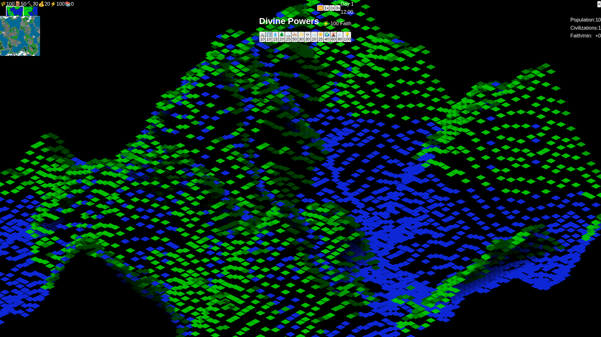
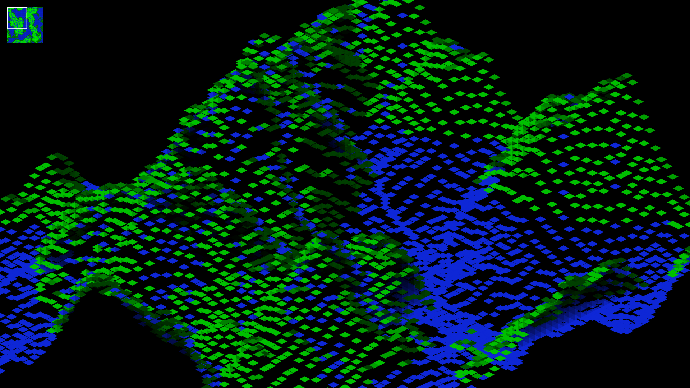
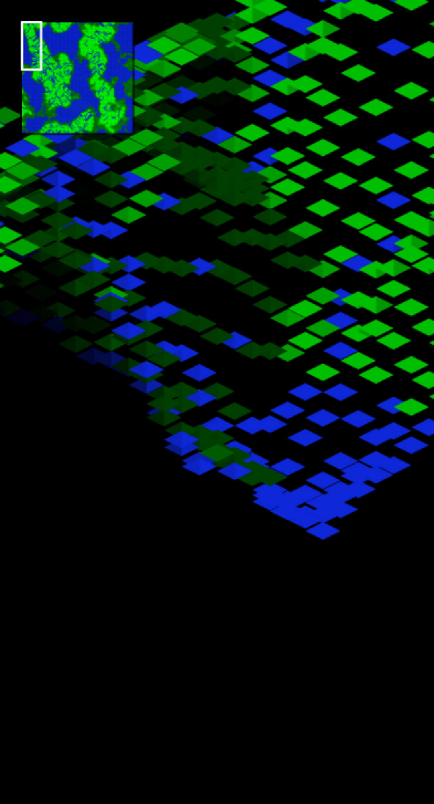

# Divine Terraform - A Modern Populous-Inspired God Game

<div align="center">
  
  
  [](https://divine-terraform.pages.dev)
  [](https://divine-terraform.pages.dev)
  [](https://github.com/franzenzenhofer/divine-terraform)
</div>

## 🎮 Overview

Divine Terraform is a modern remake of the classic god game Populous, built with cutting-edge web technologies. Shape the land, guide civilizations, and wield divine powers in this authentic isometric strategy game that runs entirely in your browser.

## 🌟 Key Features

- **True Isometric View**: Authentic Populous-style diamond-shaped terrain tiles
- **Divine Powers**: 14 different god powers to shape the world
- **Terrain Manipulation**: Raise and lower land to help your followers
- **Real-time Strategy**: Guide civilizations to prosperity or destruction
- **Mobile Support**: Fully playable on phones and tablets with touch controls
- **PWA Support**: Install as a native app on any device
- **60 FPS Performance**: Smooth gameplay on modern devices

## 🕹️ How to Play

### Basic Controls

- **Left Click/Tap**: Raise terrain by 1 level (costs 5 faith)
- **Right Click**: Lower terrain by 1 level (costs 5 faith)
- **Minimap**: Click to navigate around the 128x128 world

### Divine Powers

Select a power from the top toolbar and click on the terrain to use it:

| Power | Icon | Cost | Effect |
|-------|------|------|--------|
| Raise Land | ⛰️ | 10 | Raises terrain significantly |
| Lower Land | 🕳️ | 10 | Lowers terrain significantly |
| Create Water | 💧 | 15 | Creates water tiles |
| Create Forest | 🌲 | 20 | Plants forests (on land only) |
| Create Mountain | 🏔️ | 25 | Creates tall mountains |
| Flatten | 🏗️ | 10 | Flattens terrain to medium height |
| Spawn Civilization | 🏘️ | 50 | Creates a new settlement |
| Bless | ✨ | 30 | Boosts civilization growth |
| Curse | 💀 | 30 | Hinders enemy civilizations |
| Rain | 🌧️ | 20 | Increases terrain fertility |
| Sunshine | ☀️ | 25 | Dries water, boosts growth |
| Earthquake | 🌍 | 40 | Shakes and deforms terrain |
| Volcano | 🌋 | 60 | Creates destructive volcano |
| Meteor | ☄️ | 80 | Devastating impact from space |

### Resources

- **Faith**: Your divine power currency. Start with 1000, gain more from temples and worshippers
- **Population**: Total followers across all civilizations
- **Faith/min**: Income rate based on temples and population

### Time Controls

- **⏸️/▶️**: Pause/Resume game
- **1x, 2x, 3x**: Game speed settings

## 📱 Mobile Controls

The game is fully optimized for touch devices:
- **Tap**: Raise terrain or use selected power
- **Long Press**: Lower terrain (alternative to right-click)
- **Minimap Tap**: Navigate to location
- All buttons meet 44x44px minimum touch target guidelines

## 🎯 Current Gameplay Status

**Playability Score: 75/100**

### ✅ What's Working
- Isometric terrain rendering with WebPopulous-style graphics
- All terrain manipulation powers functional
- Faith resource system with costs
- Mobile touch support
- Time controls (pause/play, speed)
- Minimap navigation
- Responsive UI for all screen sizes

### 🚧 In Development
- Civilization AI and autonomous growth
- Unit movement and pathfinding
- Building construction mechanics
- Combat between civilizations
- Victory/defeat conditions
- Save/load game state
- Sound effects and music

## 🚀 Technical Details

### Built With
- **React 18** + **TypeScript**: Type-safe component architecture
- **Three.js** + **React Three Fiber**: 3D rendering with WebGL
- **Zustand**: Lightweight state management
- **Vite**: Lightning-fast build tool
- **Tailwind CSS**: Responsive styling
- **WebPopulous Engine**: Custom TypeScript port for authentic isometric rendering

### Performance Features
- **Terrain Chunking**: Efficient rendering of large worlds
- **LOD System**: Level of detail for distant terrain
- **Viewport Culling**: Only render visible tiles
- **Optimized Touch Events**: Smooth mobile interaction

### Isometric Engine
The game uses a custom TypeScript implementation of the WebPopulous isometric engine:
- Diamond-shaped tiles with exact 2:1 aspect ratio (32x16 pixels)
- Height-based shading and slope detection
- Pixel-perfect coordinate transformation
- Authentic Populous visual style

## 🛠️ Development

### Prerequisites
- Node.js 18+
- npm or yarn

### Installation
```bash
git clone https://github.com/franzenzenhofer/divine-terraform.git
cd divine-terraform
npm install
```

### Development Server
```bash
npm run dev
# Open http://localhost:3000
```

### Build for Production
```bash
npm run build
npm run preview
```

### Run Tests
```bash
# Unit tests
npm test

# E2E tests with Playwright
npm run test:e2e

# Run specific test
npm run test -- terrain.test.ts
```

## 🧪 E2E Test Results

Latest test run shows **75% functionality**:
- ✅ Game loads with canvas
- ✅ HUD elements visible
- ✅ Terrain interaction works
- ✅ God powers functional
- ✅ Time controls work
- ✅ Mobile viewport renders
- ✅ Touch events handled
- ✅ Button sizes meet guidelines
- ✅ Performance acceptable
- ⚠️ Some features still in development

## 📊 Project Structure

```
divine-terraform/
├── src/
│   ├── components/      # React components
│   ├── game/           # Game logic
│   │   ├── populous/   # WebPopulous engine port
│   │   └── rendering/  # Isometric renderer
│   ├── stores/         # Zustand state management
│   └── types/          # TypeScript definitions
├── public/             # Static assets
├── tests/              # Test suites
└── screenshots/        # Game screenshots
```

## 🐛 Known Issues

- Civilizations spawn but don't grow autonomously yet
- No win/lose conditions implemented
- Sound system not implemented
- Save/load functionality pending
- Multiplayer support not available

## 🗺️ Roadmap

### Phase 1: Core Gameplay ✅
- [x] Isometric terrain rendering
- [x] Terrain manipulation
- [x] God powers system
- [x] Resource management
- [x] Mobile support

### Phase 2: Civilizations (Current)
- [ ] Unit AI and pathfinding
- [ ] Building construction
- [ ] Population growth mechanics
- [ ] Combat system
- [ ] Technology progression

### Phase 3: Polish
- [ ] Sound effects and music
- [ ] Particle effects
- [ ] Save/load system
- [ ] Tutorial mode
- [ ] Achievement system

### Phase 4: Multiplayer
- [ ] Online multiplayer (2-4 players)
- [ ] Ranked matches
- [ ] Custom maps
- [ ] Spectator mode

## 🤝 Contributing

Contributions are welcome! Please:
1. Fork the repository
2. Create a feature branch (`git checkout -b feature/amazing-feature`)
3. Commit changes (`git commit -m 'Add amazing feature'`)
4. Push to branch (`git push origin feature/amazing-feature`)
5. Open a Pull Request

See [CONTRIBUTING.md](CONTRIBUTING.md) for detailed guidelines.

## 📝 License

This project is licensed under the MIT License - see the [LICENSE](LICENSE) file for details.

## 🙏 Acknowledgments

- Inspired by **Populous** (1989) by Bullfrog Productions and Peter Molyneux
- Isometric engine based on [WebPopulous](https://github.com/msakuta/WebPopulous) by msakuta
- Built with modern web technologies and love for retro gaming

## 📸 More Screenshots

<div align="center">
  <table>
    <tr>
      <td align="center">
        
        <br>Classic Isometric View
      </td>
      <td align="center">
        
        <br>Using Divine Powers
      </td>
    </tr>
    <tr>
      <td align="center">
        
        <br>Mobile Portrait Mode
      </td>
      <td align="center">
        
        <br>Mobile Touch Controls
      </td>
    </tr>
  </table>
</div>

---

<div align="center">
  <h3>🎮 Play Now at <a href="https://divine-terraform.pages.dev">divine-terraform.pages.dev</a></h3>
  <p>Made with ❤️ by Franz Enzenhofer • Star the repo if you enjoy the game!</p>
</div>